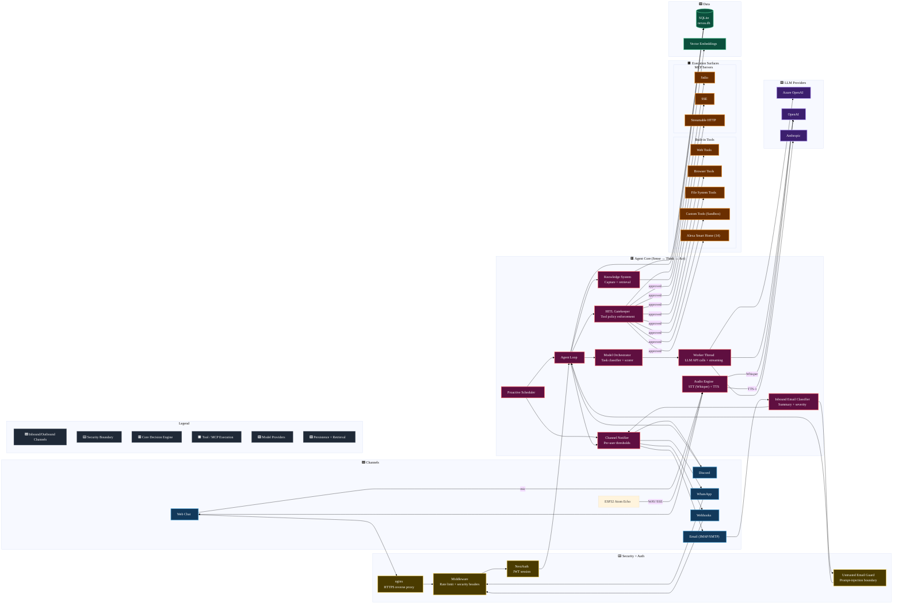

# Nexus Agent — Architecture

> **Summary:** High-level system architecture — agent loop, threading model, caching layers, multi-user isolation, and project layout. For API routes and DB schema, see [Tech Specs](TECH_SPECS.md).

> Back to [README](../README.md) | [Tech Specs](TECH_SPECS.md) | [Installation](INSTALLATION.md) | [Usage](USAGE.md)

## Architecture Diagram



---

## Sense-Think-Act Loop

The system follows a **Sense-Think-Act** loop. It observes its environment through MCP servers, built-in web/browser/file-system tools, and communication channels — then acts autonomously grounded in per-user knowledge.

This loop also supports end-to-end career workflows: discover relevant jobs from public listings (including LinkedIn links via web search), tailor a resume per role with file generation tools, and deliver a ready-to-submit package through the email tool.

1. **Sense** — Receive input from web chat, Discord, WhatsApp, webhooks, or the proactive scheduler
2. **Think** — Retrieve relevant knowledge via cache-first semantic search (skipped entirely if the user's knowledge vault is empty), construct a context-rich prompt, and call the LLM
3. **Act** — Execute tool calls (with HITL gating), capture new knowledge, and deliver the response

### Voice Input & Output (STT / TTS)

- **Speech-to-Text** — Mic button records audio (MediaRecorder, `audio/webm`), transcribed by OpenAI Whisper via `POST /api/audio/transcribe`. Optional local Whisper fallback when cloud STT fails.
- **Text-to-Speech** — Speaker icon on assistant messages plays TTS-1 audio (9 voices, user-selectable). Supports mp3/wav/pcm/opus/aac/flac output.
- **Conversation Mode** — Full-screen voice tab (`/conversation`) with VAD-based auto-listen, interrupt/barge-in, and lightweight `/api/conversation/respond` endpoint (full tool support, no DB persistence).
- **ESP32 Atom Echo** — Standalone Arduino firmware with on-device wake-word detection via micro-wake-up. See [`esp32/atom-echo-nexus/README.md`](../esp32/atom-echo-nexus/README.md).

### Real-Time Streaming

The chat API uses **Server-Sent Events (SSE)** via a `ReadableStream` to stream tokens in real-time. Both OpenAI and Anthropic providers support token-level streaming for instant perceived latency.

**Disconnect safety** — All SSE writes go through a `sseSend()` wrapper that checks a `streamCancelled` flag, preventing crashes when clients disconnect mid-stream.

**SSE event types:**

| Event | Description |
|-------|-------------|
| `token` | Individual text tokens streamed from the LLM |
| `status` | Agent thinking steps (model selection, knowledge retrieval, tool execution) |
| `message` | Complete messages persisted to DB |
| `done` | Agent loop completed |
| `error` | Error details (sanitized) |

### Worker Thread Architecture

LLM API calls are offloaded to a **Worker Thread** (`scripts/agent-worker.js`) to keep the main event loop responsive. Tool execution, DB access, and knowledge retrieval remain on the main thread, coordinated via IPC (`postMessage`).

- Pool size configurable via `WORKER_POOL_SIZE` env var (default 2, max 8)
- Workers are recycled between tasks; crashed workers are auto-replaced
- Automatic fallback to main thread if the worker is unavailable
- 120-second timeout per task

**Files:** `scripts/agent-worker.js`, `src/lib/agent/worker-manager.ts`, `src/lib/agent/loop-worker.ts`

### Caching Strategy

Multiple caching layers eliminate redundant DB queries and API calls:

| Layer | Location | TTL | Purpose |
|-------|----------|-----|---------|
| **Application cache** | `src/lib/cache.ts` | 60s + explicit invalidation | LLM providers, tool policies, users, profiles, channels, auth providers, MCP servers |
| **Provider instance cache** | `src/lib/llm/orchestrator.ts` | 10s | Avoids re-constructing SDK clients per request |
| **Embedding result cache** | `src/lib/llm/embeddings.ts` | 1 hour, max 500 (LRU) | Eliminates redundant embedding API calls |
| **Parsed vault cache** | `src/lib/knowledge/retriever.ts` | 300s | Avoids re-parsing JSON embedding vectors |

All caches use explicit invalidation on mutations as the primary mechanism, with TTL as a safety net.

**Event loop protection** — `await yieldLoop()` (backed by `setImmediate()`) is inserted at critical points in the agent loop to prevent synchronous `better-sqlite3` calls from starving the event loop.

### Notification & Channel Safety

- **Per-user thresholds** — Notifications filtered by each user's `notification_level` (low → disaster).
- **Severity capping** — Smart home/IoT tools are capped at `high` severity (never `disaster`).
- **Injection boundary** — Inbound email bodies are treated as untrusted content and sanitized before LLM ingestion.
- **Per-message UID persistence** — IMAP processing updates last-seen UID per message to prevent re-processing on crash.

---

## Core Architectural Principles

| Principle | Description |
|-----------|-------------|
| **Multi-User Isolation** | Knowledge, threads, and profiles scoped by `user_id`. No cross-user data leakage. |
| **Proactive Intelligence** | Background scheduler polls MCP tools, writes actions into a persisted task queue, and executes due tasks. Can create new custom tools at runtime. |
| **Unified Scheduler** | Normalized parent schedules → child tasks → immutable run history. Powers proactive scans, knowledge maintenance, DB cleanup, and batch workflows (e.g. Job Scout). |
| **Autonomous Knowledge Capture** | Every chat turn is mined for durable facts, keeping the Knowledge Vault current without manual entry. |
| **Vector-Aware Reasoning** | Semantic embedding search retrieves relevant knowledge before responding (skipped if vault is empty). |
| **Human-in-the-Loop (HITL)** | Default-deny tool policy system for all tools (built-in, custom, MCP). Standing orders let users save approval preferences. |
| **Model Orchestrator** | Task routing classifies messages and selects the best LLM based on capabilities, speed, and cost. |
| **Self-Extending Tools** | Agent can create, compile, and register new tools at runtime. Custom tools run in a VM sandbox. |
| **Native SDKs** | Direct use of Azure OpenAI, OpenAI, Anthropic, LiteLLM, and MCP SDKs — no LangChain. |
| **MCP Auto-Refresh** | Subscribes to `list_changed` notifications. Tool list refreshed with 500 ms debounce — no restart required. |
| **Browser Automation** | Playwright-powered tools for page navigation, form filling, screenshots, and session management. |
| **Multi-Channel Comms** | WhatsApp, Discord, webhooks, email — each channel resolves senders to internal users. |
| **Alexa Smart Home** | 14 tools for announcements, lights, volume, sensors, DND, and device management. |
| **Analytics Dashboard** | Date-range KPIs, session outcomes, trend charts, and topic drivers with drilldown to raw logs. |

---

## UI Navigation

- The header account area (top-right) provides quick access to **Profile** and **Sign out**.
- Approvals and system notifications are accessed via the **bell icon** (Notification Center), not as a standalone tab.

---

## Client-Side Routing

The UI is a single-page app served by a Next.js **optional catch-all** route (`[[...path]]/page.tsx`). URL paths are mapped to tabs and settings pages entirely on the client.

### Main Tabs

| URL Path | Tab |
|----------|-----|
| `/` or `/chat` | Chat |
| `/dashboard` | Dashboard |
| `/knowledge` | Knowledge |
| `/settings/*` | Settings |

> **Note:** Approvals and system notifications are accessed via the bell icon in the header bar (Notification Center), not as a standalone tab.

### Settings Sub-Pages

The Settings tab contains 13 chip-selectable sub-pages, gated by permissions or admin role.

| Key | Label | Gate |
|-----|-------|------|
| `llm` | Providers | `llm_config` perm |
| `channels` | Channels | `channels` perm |
| `mcp` | MCP Servers | `mcp_servers` perm |
| `policies` | Tool Policies | Admin |
| `standing-orders` | Standing Orders | — |
| `alexa` | Alexa | — |
| `whisper` | Local Whisper | — |
| `logging` | Logging | Admin |
| `db-management` | DB Management | Admin |
| `custom-tools` | Custom Tools | — |
| `auth` | Authentication | Admin |
| `users` | User Management | Admin |
| `scheduler` | Scheduler | Admin |

Permissions are fetched from `GET /api/admin/users/me`. Hidden pages are removed from the chip strip once permissions resolve.

---

## Multi-User Model

| Role | Capabilities |
|------|-------------|
| **Admin** | Full access — manage LLM providers, MCP servers, tool policies, users, logs, scheduler. First user to sign up. |
| **User** | Own knowledge, threads, channels, profile. Access global MCP servers + user-scoped servers. |

### Isolation

- **Knowledge** — `user_knowledge` keyed by `user_id`; same entity/attribute can exist per user.
- **Threads** — Each thread has a `user_id` foreign key; ownership enforced on all operations.
- **MCP Servers** — `scope` field: global (all users) or user-scoped (owner only).
- **Channels** — Owned by creator; webhook messages resolve the channel owner as the active user.

---

## Project Structure

```
src/
├── app/                        # Next.js App Router
│   ├── api/                    # API route handlers
│   │   ├── admin/              # User management (admin-only)
│   │   ├── approvals/          # HITL approval inbox (user-scoped)
│   │   ├── attachments/        # File upload/download
│   │   ├── audio/              # Voice I/O (STT transcribe + TTS synthesis)
│   │   ├── channels/           # Inbound webhook handlers
│   │   ├── config/             # LLM, channels, profile config
│   │   ├── knowledge/          # User knowledge CRUD
│   │   ├── logs/               # Agent activity logs
│   │   ├── mcp/                # MCP server management + OAuth
│   │   ├── policies/           # Tool policy management
│   │   ├── config/custom-tools/ # Custom tools management
│   │   └── threads/            # Thread + chat management
│   ├── [[...path]]/            # Optional catch-all route (SPA routing)
│   │   └── page.tsx            # Main dashboard SPA with tab/settings routing
│   ├── auth/                   # Sign-in and error pages
│   ├── globals.css             # Theme and design tokens
│   └── layout.tsx              # Root layout
├── components/                 # React UI components
│   ├── ui/                     # MUI adapter primitives (button, card, input, badge, switch, textarea, scroll-area)
│   ├── agent-dashboard.tsx     # Full analytics dashboard + drilldown log explorer
│   ├── alexa-config.tsx        # Alexa Smart Home credential management
│   ├── api-keys-config.tsx     # API key management
│   ├── approval-inbox.tsx      # HITL approval UI (legacy, superseded by notification-bell)
│   ├── auth-config.tsx         # Authentication provider configuration
│   ├── channels-config.tsx     # Channel management (user-scoped)
│   ├── chat-panel.tsx          # Chat orchestrator — owns all state, composes ThreadSidebar + ChatArea + InputBar
│   ├── chat-panel-types.ts    # Shared types (Thread, Message, PendingFile, etc.) and utility functions
│   ├── thread-sidebar.tsx     # Memo'd thread list sidebar (thread select, create, delete, load more)
│   ├── chat-area.tsx          # Memo'd virtualized message display (@tanstack/react-virtual, ThinkingBlock, ThoughtsBlock, AttachmentPreview)
│   ├── input-bar.tsx          # Memo'd input area (text, file attach, screen share, audio recording, send)
│   ├── conversation-mode.tsx   # Full-screen voice conversation (VAD + TTS + worker thread)
│   ├── custom-tools-config.tsx # Custom tools CRUD
│   ├── knowledge-vault.tsx     # Knowledge CRUD
│   ├── llm-config.tsx          # LLM provider management
│   ├── logging-config.tsx      # Logging configuration
│   ├── markdown-message.tsx    # Markdown renderer (react-markdown + remark-gfm) for assistant messages
│   ├── mcp-config.tsx          # MCP server management
│   ├── notification-bell.tsx   # Unified notification center (bell icon popover with approvals + system alerts)
│   ├── profile-config.tsx      # User profile editor with feature toggles
│   ├── providers.tsx           # NextAuth SessionProvider wrapper
│   ├── theme-provider.tsx      # MUI theme provider (light/dark)
│   ├── tool-policies.tsx       # Tool approval policy management
│   ├── user-management.tsx     # Admin user management
│   └── whisper-config.tsx      # Local Whisper STT configuration
├── lib/
│   ├── agent/                  # Core agent logic
│   │   ├── loop.ts             # Sense-Think-Act agent loop
│   │   ├── loop-worker.ts      # Worker thread integration layer (fallback to main thread)
│   │   ├── worker-manager.ts   # Worker lifecycle, IPC handling, 120s timeout
│   │   ├── gatekeeper.ts       # HITL policy enforcement
│   │   ├── discovery.ts        # Tool discovery, group inference, name normalization
│   │   ├── custom-tools.ts     # Self-extending tool system (VM sandbox)
│   │   ├── web-tools.ts        # Web search/fetch tools
│   │   ├── browser-tools.ts    # Playwright browser automation
│   │   ├── fs-tools.ts         # File system tools
│   │   └── alexa-tools.ts      # Alexa Smart Home integration (14 tools)
│   ├── auth/                   # Authentication
│   │   ├── options.ts          # NextAuth config (multi-user)
│   │   ├── guard.ts            # requireUser/requireAdmin guards
│   │   └── index.ts            # Auth exports
│   ├── db/                     # Database layer
│   │   ├── schema.ts           # DDL definitions
│   │   ├── init.ts             # Schema init + migrations
│   │   ├── queries.ts          # All query functions
│   │   └── connection.ts       # SQLite connection
│   ├── knowledge/              # Knowledge system
│   │   ├── index.ts            # Ingestion pipeline
│   │   └── retriever.ts        # Semantic + keyword search
│   ├── llm/                    # LLM provider abstraction
│   │   ├── orchestrator.ts     # Model routing & task classification + worker config export
│   │   ├── openai-provider.ts  # OpenAI / Azure OpenAI
│   │   ├── anthropic-provider.ts
│   │   ├── embeddings.ts       # Embedding generation
│   │   └── types.ts            # ChatProvider interface
│   ├── channels/               # Channel integrations
│   │   └── discord.ts          # Discord Gateway bot (uses channel owner resolution)
│   ├── mcp/                    # MCP client management
│   │   └── manager.ts          # Connect, discover, invoke, auto-refresh
│   ├── audio.ts                # Audio utility (getAudioClient, transcribeAudio, textToSpeech)
│   ├── cache.ts                # In-memory write-through cache (LLM providers, tool policies, users, profiles)
│   ├── scheduler/              # Proactive cron scheduler
│   ├── knowledge-maintenance/  # Evening knowledge dedupe worker launcher + scheduling helpers
│   └── bootstrap.ts            # Runtime initialization
├── middleware.ts                # Auth + rate limiting + security middleware
scripts/
├── agent-worker.js             # Worker thread entry point for LLM API calls (plain JS, standalone)
└── knowledge-maintenance-worker.js # Worker thread entry for nightly knowledge declutter
```
