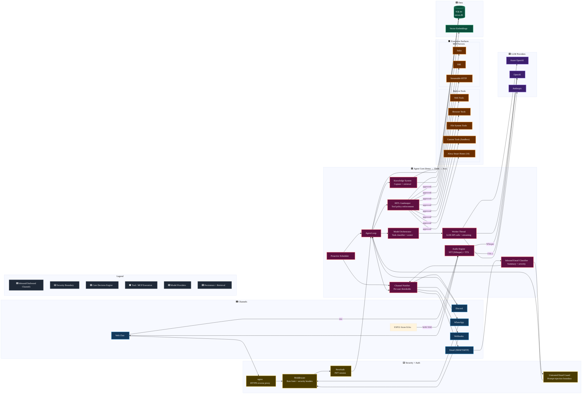

# Nexus Agent — Architecture

> Back to [README](../README.md) | [Tech Specs](TECH_SPECS.md) | [Installation](INSTALLATION.md) | [Usage](USAGE.md)

---

## Architecture Diagram



---

## Sense-Think-Act Loop

The system follows a **Sense-Think-Act** loop. It observes its environment through MCP servers, built-in web/browser/file-system tools, and communication channels — then acts autonomously grounded in per-user knowledge.

1. **Sense** — Receive input from web chat, Discord, WhatsApp, webhooks, or the proactive scheduler
2. **Think** — Retrieve relevant knowledge via cache-first semantic search (skipped entirely if the user's knowledge vault is empty), construct a context-rich prompt, and call the LLM
3. **Act** — Execute tool calls (with HITL gating), capture new knowledge, and deliver the response

### Voice Input & Output (STT / TTS)

The chat interface supports **voice input** (Speech-to-Text) and **voice output** (Text-to-Speech) powered by OpenAI's audio models.

- **Speech-to-Text**: Click the mic button to record audio via the browser MediaRecorder API (`audio/webm;codecs=opus`). The recording is sent to `POST /api/audio/transcribe` which forwards it to OpenAI's **Whisper** (`whisper-1`) model. The transcribed text is appended to the chat input field. Max file size: 25 MB.
- **Text-to-Speech**: Click the speaker icon on any assistant message to hear it read aloud. The message text is sent to `POST /api/audio/tts` which calls OpenAI's **TTS-1** model (default voice: `nova`, 9 voices available: alloy, ash, coral, echo, fable, onyx, nova, sage, shimmer). Users can select their preferred voice in **Settings → Profile → Preferences & Features → TTS Voice**. The choice is persisted in the user profile and synced to localStorage for instant access. The MP3 audio plays inline via the browser Audio API. Click again to stop playback. The TTS endpoint supports multiple output formats via the `format` field: `mp3` (default), `wav`, `pcm`, `opus`, `aac`, `flac` — the `wav` and `pcm` formats are especially useful for embedded devices that lack an MP3 decoder.
- **Provider selection**: `getAudioClient()` in `src/lib/audio.ts` prefers providers with `purpose = "tts"` or `purpose = "stt"` (each maps to one deployment), then falls back to the first OpenAI-compatible provider (openai → azure-openai → litellm). Anthropic is skipped as it has no audio API. Each TTS/STT provider uses the standard `deployment` config field — no special audio-specific fields needed.
- **Audio mode**: Hands-free conversation mode is provided in the dedicated **Conversation** tab. The flow is: start mic → VAD detects end-of-speech → transcription auto-sends → TTS plays response → auto-listen resumes (when auto mode is enabled). The status banner shows current state (Listening/Transcribing/Thinking/Speaking).
- **Conversation Mode**: A dedicated full-screen voice conversation page (`/conversation` tab) separate from the chat interface. Uses **Voice Activity Detection (VAD)** via WebAudio API's `AnalyserNode` to automatically detect the end of speech (1.2s of silence after at least 0.4s of speech). State updates use an atomic `useCallback` wrapper that synchronises both React state and a `stateRef` in a single call, preventing race conditions where async code reads a stale ref. The complete flow: Listen → Detect silence → STT transcription → Send to lightweight LLM endpoint (SSE streaming with tool support) → Accumulate response → TTS playback → Auto-listen again. **Interrupt / Barge-in** — a separate lightweight interrupt VAD (`startInterruptVad`) opens a second mic stream + AudioContext during thinking/speaking states. When sustained speech is detected (≥ 200 ms at 2× the silence threshold to avoid TTS speaker bleed), `interruptAndListen()` fires: aborts the LLM request, pauses TTS playback, marks the last assistant transcript with a "⸺" indicator, and transitions directly to listening. Features include: real-time audio level visualization, transcript display with chat bubbles, voice selector (9 voices), auto/manual listen toggle, interrupt / barge-in support, and in-memory conversation history (no thread/DB persistence). The component is at `src/components/conversation-mode.tsx` and uses a dedicated `/api/conversation/respond` endpoint that keeps full tool access (builtins + MCP + custom) while skipping the heavy overhead of the main agent loop (no knowledge retrieval, no embedding generation, no profile context, no message persistence). History is maintained in-memory on the client side (capped at 30 messages) and passed with each request.
- **Local Whisper fallback**: Optional local Whisper server (e.g. `faster-whisper-server` or `whisper.cpp`) configured via **Settings → Local Whisper**. When enabled, if the cloud STT provider fails, `transcribeAudio()` automatically retries via the local server's OpenAI-compatible `/v1/audio/transcriptions` endpoint. Config stored in `app_config` keys: `whisper_local_enabled`, `whisper_local_url`, `whisper_local_model`. Connectivity test available via `POST /api/config/whisper`.
- **ESP32 Atom Echo integration**: A standalone Arduino/PlatformIO firmware (`esp32/atom-echo-nexus/atom_echo_nexus.ino`) for the M5Stack Atom Echo turns it into a hands-free voice assistant. Wake-word detection runs **on-device** using **micro-wake-up** (no server wake-word check). After on-device wake detection, the command audio is sent to `/api/audio/transcribe`, the resulting text is sent to `/api/conversation/respond` (full tool support), and the response is played via `/api/audio/tts` in WAV format. See [`esp32/atom-echo-nexus/README.md`](../esp32/atom-echo-nexus/README.md) for setup instructions.

### Real-Time Streaming

The chat API uses **Server-Sent Events (SSE)** via a `ReadableStream` with `controller.enqueue()` to stream responses in real-time. This approach pushes data synchronously to the readable side for immediate HTTP flushing — unlike `TransformStream` which can buffer internally. Both OpenAI and Anthropic providers support **token-level streaming** — individual text tokens are sent to the client via `event: token` SSE events as they arrive from the LLM API, providing instant perceived response time. A leading SSE comment (`: stream opened`) is sent immediately to force proxies/framework to flush headers.

**Disconnect safety**: All SSE writes go through a `sseSend()` wrapper that checks a `streamCancelled` flag before calling `controller.enqueue()`. If the `enqueue()` throws (stream already closed), the flag is set and all future writes become no-ops. The `ReadableStream`'s `cancel()` callback also sets the flag when the client disconnects (tab close, navigation, or opening a new instance). This prevents server crashes when the agent loop continues emitting tokens or error events after the client has disconnected. The `finally` block wraps `controller.close()` in a try-catch for the same reason.

The full SSE event lifecycle is:

### Worker Thread Architecture

LLM API calls are offloaded to a dedicated **Worker Thread** (`scripts/agent-worker.js`) to prevent long-running LLM streaming from blocking the Node.js main event loop. This ensures the server remains responsive to other HTTP requests while the agent is mid-conversation.

**Separation of concerns**:

| Responsibility | Thread |
|---|---|
| LLM API calls (OpenAI, Azure, Anthropic, LiteLLM) | **Worker** |
| Token streaming (SDK → IPC → SSE) | **Worker** → Main |
| Tool execution (builtins, MCP, custom tools) | **Main** |
| Database operations (messages, knowledge, threads) | **Main** |
| Knowledge retrieval & embedding search (gated on vault having entries) | **Main** |
| HITL gatekeeper enforcement | **Main** |
| SSE relay to client | **Main** |

**IPC Protocol** (via `parentPort.postMessage` / `worker.postMessage`):

| Direction | Message Type | Payload |
|---|---|---|
| Main → Worker | `start` | Provider config, system prompt, chat messages, tool definitions |
| Main → Worker | `tool_result` | Executed tool results (response to `tool_request`) |
| Main → Worker | `abort` | Cancel mid-execution |
| Worker → Main | `token` | Streamed text token from LLM |
| Worker → Main | `status` | Step update (e.g. "calling model…") |
| Worker → Main | `tool_request` | LLM returned tool calls — main thread executes and replies |
| Worker → Main | `done` | Final response text + tool call history |
| Worker → Main | `error` | Error details |

**Fallback**: If the worker script is missing or the worker process fails, the system automatically falls back to running the LLM call on the main thread via the original `runAgentLoop()` function. Continuation agent loops (follow-up tool iterations) also run on the main thread.

**Files**:
- `scripts/agent-worker.js` — Standalone worker entry point (plain JS, uses `require()`)
- `src/lib/agent/worker-manager.ts` — Worker lifecycle management + IPC handling (120s timeout)
- `src/lib/agent/loop-worker.ts` — Integration layer wrapping worker with knowledge, tools, DB persistence

1. `event: token` — Individual text tokens streamed from the LLM in real-time (displayed progressively in the chat UI)
2. `event: status` — Agent thinking steps (model selection, knowledge retrieval, tool execution)
3. `event: message` — Complete messages persisted to DB (user echo, assistant responses, tool results)
4. `event: done` — Agent loop completed with final result
5. `event: error` — Error occurred during processing

The `onToken` callback is threaded from the chat route → agent loop → LLM provider. When streaming is enabled, providers use `stream: true` (OpenAI) or `messages.stream()` (Anthropic) to yield tokens incrementally. The complete response is still returned from `provider.chat()` for DB persistence and tool-call processing. Each message includes a `created_at` timestamp persisted in the database.

The SSE stream supports three event types:

| Event      | Description |
|------------|-------------|
| `status`   | Agent analysis steps (model selection, knowledge retrieval, LLM call). Shown in a collapsible "Analyzing…" block in the UI — similar to Gemini/Copilot thinking indicators. |
| `message`  | Database-persisted messages (user, assistant, tool). Standard chat messages with full content. |
| `done`     | Final response metadata emitted when the agent loop completes. Triggers thread list refresh. |
| `error`    | Error details when the agent loop throws, sanitized to avoid leaking paths. |

The `status` events provide transparency into the agent's internal process for **every** response — not just tool-using ones — so users always see what the agent is doing (selecting a model, searching the knowledge vault, generating a response).

### Caching & Event Loop Protection

**Application Cache** (`src/lib/cache.ts`): An in-memory write-through cache for frequently-read, rarely-changed data that was previously queried from SQLite on every single request. Two invalidation strategies work together:

1. **Explicit invalidation** — mutation functions (e.g. `createLlmProvider`, `updateUserRole`, `upsertToolPolicy`) automatically call `appCache.invalidate()` when they modify data (instant, primary mechanism).
2. **TTL expiration** — 60-second safety net in case a mutation path misses invalidation.

| Cached Data | Cache Key | Invalidated By |
|---|---|---|
| LLM providers (decrypted) | `llm_providers` | `createLlmProvider`, `updateLlmProvider`, `deleteLlmProvider`, `setDefaultLlmProvider` |
| Tool policies | `tool_policies` | `upsertToolPolicy` |
| User records (role/enabled) | `user:{userId}` | `updateUserRole`, `updateUserEnabled`, `deleteUser` |
| User profiles | `profile:{userId}` | `upsertUserProfile`, `deleteUser` |
| Auth lookup by email (5-min TTL) | `user_email:{email}` | `updateUserRole`, `updateUserEnabled`, `updateUserPassword`, `deleteUser` |
| Auth lookup by external sub (5-min TTL) | `user_sub:{subId}` | `updateUserRole`, `updateUserEnabled`, `updateUserPassword`, `deleteUser` |
| Channels (decrypted, per-user) | `channels:{userId}` | `createChannel`, `updateChannel`, `deleteChannel` |
| Auth providers (decrypted) | `auth_providers` | `upsertAuthProvider`, `deleteAuthProvider` |
| MCP servers (decrypted, per-user) | `mcp_servers:{userId}` | `upsertMcpServer`, `deleteMcpServer` |

**Provider Instance Cache** (`src/lib/llm/orchestrator.ts`): A separate module-level `Map` caches constructed `ChatProvider` instances keyed by a SHA-256 hash of `{id, type, config}`. TTL is 10 seconds. When an LLM provider row is created, updated, or deleted via the `/api/config/llm` route handlers, `invalidateProviderCache()` is called to flush all entries. This avoids re-parsing config JSON plus re-instantiating SDK clients on every request while still reflecting admin changes within seconds.

**Embedding Result Cache** (`src/lib/llm/embeddings.ts`): A module-level LRU `Map` caches generated embeddings keyed by a SHA-256 hash of the query text. TTL is 1 hour, max 500 entries with LRU eviction (oldest-insertion evicted when full). Identical queries across users or repeated knowledge retrievals return cached embeddings without an API call (100-500 ms savings per hit). `invalidateEmbeddingCache()` clears all entries.

**Parsed Vault Embedding Cache** (`src/lib/knowledge/retriever.ts`): A module-level cache stores parsed embedding vectors (JSON → `number[]`) keyed by user. TTL is **300 seconds** (5 min, increased from 30s in PERF-03) to reduce redundant JSON parsing of the entire vault on every search call. Explicit invalidation via `invalidateEmbeddingCache()` on knowledge ingestion ensures new entries are visible immediately despite the longer TTL.

Previously, `selectProvider()` called `listLlmProviders()` (full table scan + decryption) on every request — now cached. Similarly, `getUserById()` and `listToolPolicies()` were called per-request for role checks and tool filtering — now cached. Auth lookups (`getUserByEmail`, `getUserByExternalSub`) use a 5-minute TTL to avoid DB hits on every login/OAuth flow; all user mutation paths invalidate the by-id, by-email, and by-sub caches atomically.

**Event Loop Yield Points**: Because `better-sqlite3` is synchronous, the agent loop uses `await yieldLoop()` (backed by `setImmediate()`) at critical points to prevent blocking the Node.js event loop:

- At the top of each tool iteration loop (before calling the LLM)
- Between each tool execution (before `executeToolWithPolicy()`)
- Between tool executions in the conversation endpoint

This ensures other HTTP requests (including new tabs, API calls, and the conversation endpoint) can be served even while a long-running agent loop with multiple tool calls is executing.

**Approval Query Optimization** (`src/lib/db/queries.ts`): The `/api/notifications` and `/api/approvals` GET handlers previously suffered from an N+1 query pattern — each pending approval triggered a separate `getThread()` call to verify ownership and staleness. This was replaced with:

- `listPendingApprovalsForUser(userId)` — a single `JOIN` query (`approval_queue ⨝ threads`) that returns only the current user's pending approvals in O(1) queries instead of O(n).
- `cleanStaleApprovals()` — a bulk `UPDATE` that rejects orphaned approvals (deleted thread) and stale approvals (thread no longer in `awaiting_approval` status) in two statements, replacing per-row staleness checks. Proactive approvals (`thread_id IS NULL`) are preserved.

### Notification & Inbound Email Safety Path

- **Per-user thresholds** — Channel notifications are filtered by each user profile's `notification_level` (`low`, `medium`, `high`, `disaster`).
- **Severity capping** — Smart home / IoT tools (Alexa, Hue, Nest, Ring, etc.) are automatically capped at `high` severity — they can never emit `disaster`-level events, regardless of LLM assessment. This prevents false critical alerts for routine device state changes.
- **Channel-first alerts** — Proactive/admin/unknown-sender notices are delivered through configured communication channels instead of posting into chat threads.
- **System sender priority** — Inbound emails from system addresses (`no-reply@`, `noreply@`, `mailer-daemon@`, etc.) are automatically classified as `system` category with `low` severity before any LLM classification, preventing false security alerts from automated senders.
- **Unknown sender summaries** — Inbound IMAP messages from unknown senders are summarized and severity-classified before notification routing.
- **Per-message UID persistence** — Each processed IMAP message updates the channel's last-seen UID immediately (in a `finally` block), so a crash mid-batch does not cause re-processing of already-handled messages.
- **Injection boundary** — Inbound email bodies are treated as untrusted external content and wrapped/sanitized before any LLM prompt ingestion.

---

## Core Architectural Principles

| Principle | Description |
|-----------|-------------|
| **Multi-User Isolation** | Each user's knowledge, threads, and profile are scoped by `user_id`. No cross-user data leakage. |
| **Proactive Intelligence** | A background scheduler polls MCP tools, writes discovered actions into a persisted scheduled-task queue, and executes due tasks by frequency. The proactive observer LLM is aware of all available tools (builtins + MCP + custom) and can create new custom tools via `builtin.nexus_create_tool` when it identifies automation opportunities. Schedule is configurable via **Settings → Scheduler** (stored in `app_config`). Proactive approvals (no chat thread) surface in the Notification Center (bell icon) and are visible to admins. |
| **Autonomous Knowledge Capture** | Every chat turn is mined for durable facts, keeping the Knowledge Vault up to date without manual entry. |
| **Vector-Aware Reasoning** | Semantic embedding search retrieves the most relevant knowledge before responding. |
| **Human-in-the-Loop (HITL)** | Unified tool policy system governs ALL tools (built-in, custom, and MCP). Per-tool approval, proactive toggles, and **scope** (`global` = all users, `user` = admin only). Sensitive calls are held in an approval queue. Both thread-bound and proactive (threadless) approvals are surfaced in the Notification Center bell icon. Non-admin users only see tools with `scope = 'global'` in the agent loop. |
| **Model Orchestrator** | Intelligent task routing classifies each message (complex/simple/background/vision) and selects the best LLM provider based on capabilities, speed, cost, and tier. |
| **Self-Extending Tools** | The agent can create, compile, and register new tools at runtime. Custom tools run in a VM sandbox with no file system or process access. |
| **Native SDKs** | Direct use of Azure OpenAI, OpenAI, Anthropic, LiteLLM, and MCP SDKs — no LangChain. |

---

## UI Navigation Notes

- The header account area (top-right) opens an account dropdown with **Profile** and **Sign out** actions.
- Profile is still available under **Settings → Profile**, but quick access is intentionally provided from the account dropdown.
| **Worker Thread Isolation** | LLM API calls run in a dedicated Worker Thread to prevent token streaming from blocking the main event loop. Tool execution, DB access, and knowledge retrieval remain on the main thread. Automatic fallback to main thread if the worker is unavailable. |
| **MCP Auto-Refresh** | Subscribes to `list_changed` notifications from MCP servers. When a server installs or removes tools at runtime (e.g. Forage), the tool list is refreshed automatically with a 500 ms debounce — no restart required. |
| **MCP Tool Name Qualification** | MCP tool names are qualified as `serverId.toolName` and automatically truncated to fit the OpenAI 64-character limit. A reverse map resolves truncated names back to originals for MCP server calls. |
| **Tool Array Cap & multi_tool_use** | All LLM dispatch paths cap the tools array at 128 (OpenAI limit). The `expandMultiToolUse()` function expands OpenAI's synthetic `multi_tool_use.parallel` call into individual tool calls before dispatch. |
| **Browser Automation** | Playwright-powered tools let the agent navigate pages, fill forms, take screenshots, and manage sessions. |
| **File System Access** | Built-in tools to read, write, list, and search files — with HITL gating on destructive operations. |
| **Multi-Channel Comms** | WhatsApp, Discord, webhooks, and web chat — each channel resolves senders to internal users. |
| **User-Scoped Alerting** | Per-user notification thresholds (`low` → `disaster`) suppress or deliver channel notifications based on event severity. Smart home/IoT tools are automatically capped below `disaster`. |
| **Safe Email Ingestion** | Inbound email is classified, summarized, and guarded as untrusted content before reaching the agent loop. |
| **Screen Sharing** | Share your screen with the agent via browser `getDisplayMedia()` — the agent sees what you see and can reason about it. |
| **Voice I/O (STT/TTS)** | Mic button records audio via MediaRecorder, transcribes with Whisper. Speaker button on assistant messages plays TTS-1 audio. No extra dependencies — uses the existing OpenAI SDK. |
| **Security Hardened** | Comprehensive prompt injection defense, security headers (CSP, X-Frame-Options, etc.), rate limiting, input validation, and path traversal protection. |
| **Alexa Smart Home** | Native integration with Amazon Alexa — 14 tools for announcements, light control, volume, sensors, DND, and device management. Cookie-based auth with encrypted credential storage. |
| **Analytics-Driven Observability** | Dashboard computes date-range KPIs, session outcomes, trend charts, and topic drivers with interactive drilldown to raw logs. |

---

## Client-Side Routing

The UI is a single-page app served by a Next.js **optional catch-all** route (`[[...path]]/page.tsx`). URL paths are mapped to tabs and settings pages entirely on the client.

### Main Tabs

| URL Path | Tab |
|----------|-----|
| `/` or `/chat` | Chat |
| `/dashboard` | Dashboard |
| `/knowledge` | Knowledge |
| `/settings/*` | Settings |

> **Note:** Approvals and system notifications are accessed via the bell icon in the header bar (Notification Center), not as a standalone tab.

### Settings Sub-Pages

The Settings tab contains 11 sub-pages, each rendered as horizontally-scrollable chip-selectable panels. Sub-pages may be gated by **permissions** (e.g. `channels`, `llm_config`) or restricted to **admin-only** access. The Profile page is not shown in the chip navigation but remains accessible from the account menu (top-right).

| Key | Label | Gate |
|-----|-------|------|
| `llm` | Providers | `llm_config` perm |
| `channels` | Channels | `channels` perm |
| `mcp` | MCP Servers | `mcp_servers` perm |
| `policies` | Tool Policies | Admin only |
| `alexa` | Alexa | — |
| `whisper` | Local Whisper | — |
| `logging` | Logging | Admin only |
| `custom-tools` | Custom Tools | — |
| `auth` | Authentication | Admin only |
| `users` | User Management | Admin only |
| `scheduler` | Scheduler | Admin only |

### Permission-Aware Loading

Permissions are fetched asynchronously from `GET /api/admin/users/me`. During the loading phase:

1. **Default permissions are permissive** — all features visible while loading.
2. **All settings pages are shown** in the chip strip until permissions resolve.
3. **Redirect logic is deferred** — the redirect effect that enforces page visibility is skipped until `isUserMetaLoading` becomes `false`.

Once permissions resolve, hidden pages are removed from the chip strip and any invalid active page triggers a redirect to `/settings/profile`.

---

## Multi-User Model

### Roles & Access

| Role | Capabilities |
|------|-------------|
| **Admin** | Full access. Manage LLM providers, global MCP servers, tool policies, logs, **user management** (enable/disable users, change roles, manage permissions). First user to sign up. |
| **User** | Own knowledge vault, own threads, own channels, own profile. Access global MCP servers + user-scoped servers. Approve/reject tool calls on own threads. |

Admins can manage users from the **User Management** tab — enable/disable accounts, change roles, and control granular permissions (knowledge, chat, MCP, channels, approvals, settings).

### User Isolation

- **Knowledge** — The `user_knowledge` table is keyed by `user_id`. All queries (list, search, upsert, semantic search) are scoped to the requesting user. The unique index includes `user_id` so the same entity/attribute/value can exist for different users.
- **Threads** — Each thread stores a `user_id` foreign key. Thread listing and chat operations enforce ownership checks.
- **MCP Servers** — Each server has a `scope` field (`global` or `user`). Global servers are visible to all; user-scoped servers are visible only to their owner.
- **Profiles** — Per-user profile (display name, bio, skills, links) stored in `user_profiles`.

### User-Specific Channels

Communication channels are **owned by the user who creates them**. Each channel has a `user_id` foreign key:

- Channel listing is filtered by the authenticated user (admins see all)
- Only the channel owner can edit or delete their channels
- When a message arrives on a channel webhook, the system resolves the **channel owner** as the user and routes knowledge/threads accordingly
- Legacy `channel_user_mappings` table is preserved for backward compatibility but the primary resolution uses `getChannelOwnerId()`

---

## iOS Companion App

A native **SwiftUI** iOS app (`ios/NexusAgent/`) provides full feature parity with the web UI. The app communicates with the Nexus Agent server over the existing REST + SSE API — no backend changes required.

### iOS Architecture

| Layer | Pattern | Details |
|-------|---------|------------------------------------------|
| UI | SwiftUI | iOS 17+, TabView with 5 tabs |
| State | MVVM | 8 `@MainActor` ObservableObject ViewModels |
| Network | URLSession | Cookie-based auth, SSE streaming via `URLSessionDataDelegate` |
| Auth | NextAuth flow | CSRF → credentials callback → cookie session |
| Storage | Keychain | Server URL, session cookie, user info |
| Discovery | Network scan | Auto-discovers server on local network via `/api/auth/csrf` probe |

See the [iOS README](../ios/NexusAgent/README.md) for setup instructions.

---

## Project Structure

```
ios/NexusAgent/NexusAgent/    # iOS SwiftUI companion app
├── Models/                    # 15 Codable structs
├── Services/                  # APIClient, AuthService, SSEClient, KeychainService, ServerDiscovery
├── ViewModels/                # 8 MVVM ViewModels
├── Views/                     # Auth, Chat, Knowledge, Approvals, Settings, Profile
├── ContentView.swift          # TabView root
└── NexusAgentApp.swift        # @main entry point
src/
├── app/                        # Next.js App Router
│   ├── api/                    # API route handlers
│   │   ├── admin/              # User management (admin-only)
│   │   ├── approvals/          # HITL approval inbox (user-scoped)
│   │   ├── attachments/        # File upload/download
│   │   ├── audio/              # Voice I/O (STT transcribe + TTS synthesis)
│   │   ├── channels/           # Inbound webhook handlers
│   │   ├── config/             # LLM, channels, profile config
│   │   ├── knowledge/          # User knowledge CRUD
│   │   ├── logs/               # Agent activity logs
│   │   ├── mcp/                # MCP server management + OAuth
│   │   ├── policies/           # Tool policy management
│   │   ├── config/custom-tools/ # Custom tools management
│   │   └── threads/            # Thread + chat management
│   ├── [[...path]]/            # Optional catch-all route (SPA routing)
│   │   └── page.tsx            # Main dashboard SPA with tab/settings routing
│   ├── auth/                   # Sign-in and error pages
│   ├── globals.css             # Theme and design tokens
│   └── layout.tsx              # Root layout
├── components/                 # React UI components
│   ├── ui/                     # MUI adapter primitives (button, card, input, badge, switch, textarea, scroll-area)
│   ├── agent-dashboard.tsx     # Full analytics dashboard + drilldown log explorer
│   ├── alexa-config.tsx        # Alexa Smart Home credential management
│   ├── api-keys-config.tsx     # API key management
│   ├── approval-inbox.tsx      # HITL approval UI (legacy, superseded by notification-bell)
│   ├── auth-config.tsx         # Authentication provider configuration
│   ├── channels-config.tsx     # Channel management (user-scoped)
│   ├── chat-panel.tsx          # Thread/chat with inline approvals, real-time token streaming
│   ├── conversation-mode.tsx   # Full-screen voice conversation (VAD + TTS + worker thread)
│   ├── custom-tools-config.tsx # Custom tools CRUD
│   ├── knowledge-vault.tsx     # Knowledge CRUD
│   ├── llm-config.tsx          # LLM provider management
│   ├── logging-config.tsx      # Logging configuration
│   ├── markdown-message.tsx    # Markdown renderer (react-markdown + remark-gfm) for assistant messages
│   ├── mcp-config.tsx          # MCP server management
│   ├── notification-bell.tsx   # Unified notification center (bell icon popover with approvals + system alerts)
│   ├── profile-config.tsx      # User profile editor with feature toggles
│   ├── providers.tsx           # NextAuth SessionProvider wrapper
│   ├── theme-provider.tsx      # MUI theme provider (light/dark)
│   ├── tool-policies.tsx       # Tool approval policy management
│   ├── user-management.tsx     # Admin user management
│   └── whisper-config.tsx      # Local Whisper STT configuration
├── lib/
│   ├── agent/                  # Core agent logic
│   │   ├── loop.ts             # Sense-Think-Act agent loop
│   │   ├── loop-worker.ts      # Worker thread integration layer (fallback to main thread)
│   │   ├── worker-manager.ts   # Worker lifecycle, IPC handling, 120s timeout
│   │   ├── gatekeeper.ts       # HITL policy enforcement
│   │   ├── discovery.ts        # Tool discovery, group inference, name normalization
│   │   ├── custom-tools.ts     # Self-extending tool system (VM sandbox)
│   │   ├── web-tools.ts        # Web search/fetch tools
│   │   ├── browser-tools.ts    # Playwright browser automation
│   │   ├── fs-tools.ts         # File system tools
│   │   └── alexa-tools.ts      # Alexa Smart Home integration (14 tools)
│   ├── auth/                   # Authentication
│   │   ├── options.ts          # NextAuth config (multi-user)
│   │   ├── guard.ts            # requireUser/requireAdmin guards
│   │   └── index.ts            # Auth exports
│   ├── db/                     # Database layer
│   │   ├── schema.ts           # DDL definitions
│   │   ├── init.ts             # Schema init + migrations
│   │   ├── queries.ts          # All query functions
│   │   └── connection.ts       # SQLite connection
│   ├── knowledge/              # Knowledge system
│   │   ├── index.ts            # Ingestion pipeline
│   │   └── retriever.ts        # Semantic + keyword search
│   ├── llm/                    # LLM provider abstraction
│   │   ├── orchestrator.ts     # Model routing & task classification + worker config export
│   │   ├── openai-provider.ts  # OpenAI / Azure OpenAI
│   │   ├── anthropic-provider.ts
│   │   ├── embeddings.ts       # Embedding generation
│   │   └── types.ts            # ChatProvider interface
│   ├── channels/               # Channel integrations
│   │   └── discord.ts          # Discord Gateway bot (uses channel owner resolution)
│   ├── mcp/                    # MCP client management
│   │   └── manager.ts          # Connect, discover, invoke, auto-refresh
│   ├── audio.ts                # Audio utility (getAudioClient, transcribeAudio, textToSpeech)
│   ├── cache.ts                # In-memory write-through cache (LLM providers, tool policies, users, profiles)
│   ├── scheduler/              # Proactive cron scheduler
│   └── bootstrap.ts            # Runtime initialization
├── middleware.ts                # Auth + rate limiting + security middleware
scripts/
└── agent-worker.js             # Worker thread entry point for LLM API calls (plain JS, standalone)
```
