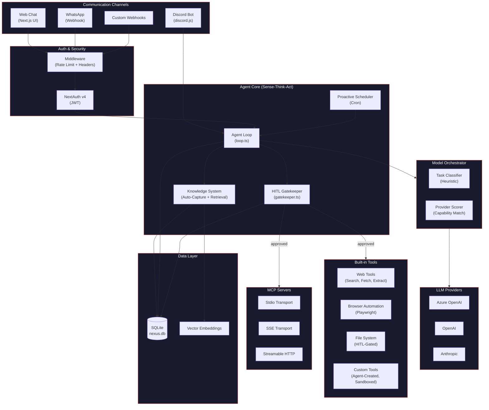

# Nexus Agent — Architecture

> Back to [README](../README.md) | [Tech Specs](TECH_SPECS.md) | [Installation](INSTALLATION.md) | [Usage](USAGE.md)

---

## Architecture Diagram



---

## Sense-Think-Act Loop

The system follows a **Sense-Think-Act** loop. It observes its environment through MCP servers, built-in web/browser/file-system tools, and communication channels — then acts autonomously grounded in per-user knowledge.

1. **Sense** — Receive input from web chat, Discord, WhatsApp, webhooks, or the proactive scheduler
2. **Think** — Retrieve relevant knowledge via semantic search, construct a context-rich prompt, and call the LLM
3. **Act** — Execute tool calls (with HITL gating), capture new knowledge, and deliver the response

---

## Core Architectural Principles

| Principle | Description |
|-----------|-------------|
| **Multi-User Isolation** | Each user's knowledge, threads, and profile are scoped by `user_id`. No cross-user data leakage. |
| **Proactive Intelligence** | A background scheduler polls MCP tools and uses the LLM to generate reminders or actions. |
| **Autonomous Knowledge Capture** | Every chat turn is mined for durable facts, keeping the Knowledge Vault up to date without manual entry. |
| **Vector-Aware Reasoning** | Semantic embedding search retrieves the most relevant knowledge before responding. |
| **Human-in-the-Loop (HITL)** | Sensitive tool calls are held in an approval queue until explicitly approved. |
| **Model Orchestrator** | Intelligent task routing classifies each message (complex/simple/background/vision) and selects the best LLM provider based on capabilities, speed, cost, and tier. |
| **Self-Extending Tools** | The agent can create, compile, and register new tools at runtime. Custom tools run in a VM sandbox with no file system or process access. |
| **Native SDKs** | Direct use of Azure OpenAI, OpenAI, Anthropic, LiteLLM, and MCP SDKs — no LangChain. |
| **Browser Automation** | Playwright-powered tools let the agent navigate pages, fill forms, take screenshots, and manage sessions. |
| **File System Access** | Built-in tools to read, write, list, and search files — with HITL gating on destructive operations. |
| **Multi-Channel Comms** | WhatsApp, Discord, webhooks, and web chat — each channel resolves senders to internal users. |
| **Screen Sharing** | Share your screen with the agent via browser `getDisplayMedia()` — the agent sees what you see and can reason about it. |
| **Security Hardened** | Comprehensive prompt injection defense, security headers (CSP, X-Frame-Options, etc.), rate limiting, input validation, and path traversal protection. |

---

## Multi-User Model

### Roles & Access

| Role | Capabilities |
|------|-------------|
| **Admin** | Full access. Manage LLM providers, global MCP servers, tool policies, logs, **user management** (enable/disable users, change roles, manage permissions). First user to sign up. |
| **User** | Own knowledge vault, own threads, own channels, own profile. Access global MCP servers + user-scoped servers. Approve/reject tool calls on own threads. |

Admins can manage users from the **User Management** tab — enable/disable accounts, change roles, and control granular permissions (knowledge, chat, MCP, channels, approvals, settings).

### User Isolation

- **Knowledge** — The `user_knowledge` table is keyed by `user_id`. All queries (list, search, upsert, semantic search) are scoped to the requesting user. The unique index includes `user_id` so the same entity/attribute/value can exist for different users.
- **Threads** — Each thread stores a `user_id` foreign key. Thread listing and chat operations enforce ownership checks.
- **MCP Servers** — Each server has a `scope` field (`global` or `user`). Global servers are visible to all; user-scoped servers are visible only to their owner.
- **Profiles** — Per-user profile (display name, bio, skills, links) stored in `user_profiles`.

### User-Specific Channels

Communication channels are **owned by the user who creates them**. Each channel has a `user_id` foreign key:

- Channel listing is filtered by the authenticated user (admins see all)
- Only the channel owner can edit or delete their channels
- When a message arrives on a channel webhook, the system resolves the **channel owner** as the user and routes knowledge/threads accordingly
- Legacy `channel_user_mappings` table is preserved for backward compatibility but the primary resolution uses `getChannelOwnerId()`

---

## Project Structure

```
src/
├── app/                        # Next.js App Router
│   ├── api/                    # API route handlers
│   │   ├── admin/              # User management (admin-only)
│   │   ├── approvals/          # HITL approval inbox (user-scoped)
│   │   ├── attachments/        # File upload/download
│   │   ├── channels/           # Inbound webhook handlers
│   │   ├── config/             # LLM, channels, profile config
│   │   ├── knowledge/          # User knowledge CRUD
│   │   ├── logs/               # Agent activity logs
│   │   ├── mcp/                # MCP server management + OAuth
│   │   ├── policies/           # Tool policy management
│   │   ├── config/custom-tools/ # Custom tools management
│   │   └── threads/            # Thread + chat management
│   ├── auth/                   # Sign-in and error pages
│   ├── globals.css             # Theme and design tokens
│   ├── layout.tsx              # Root layout
│   └── page.tsx                # Main dashboard SPA
├── components/                 # React UI components
│   ├── ui/                     # Primitives (button, card, input, etc.)
│   ├── agent-dashboard.tsx     # Activity log viewer
│   ├── approval-inbox.tsx      # HITL approval UI
│   ├── channels-config.tsx     # Channel management (user-scoped)
│   ├── chat-panel.tsx          # Thread/chat with inline approvals
│   ├── user-management.tsx     # Admin user management
│   ├── knowledge-vault.tsx     # Knowledge CRUD
│   ├── llm-config.tsx          # LLM provider management
│   ├── mcp-config.tsx          # MCP server management
│   └── profile-config.tsx      # User profile editor with feature toggles
├── lib/
│   ├── agent/                  # Core agent logic
│   │   ├── loop.ts             # Sense-Think-Act agent loop
│   │   ├── gatekeeper.ts       # HITL policy enforcement
│   │   ├── custom-tools.ts     # Self-extending tool system (VM sandbox)
│   │   ├── web-tools.ts        # Web search/fetch tools
│   │   ├── browser-tools.ts    # Playwright browser automation
│   │   └── fs-tools.ts         # File system tools
│   ├── auth/                   # Authentication
│   │   ├── options.ts          # NextAuth config (multi-user)
│   │   ├── guard.ts            # requireUser/requireAdmin guards
│   │   └── index.ts            # Auth exports
│   ├── db/                     # Database layer
│   │   ├── schema.ts           # DDL definitions
│   │   ├── init.ts             # Schema init + migrations
│   │   ├── queries.ts          # All query functions
│   │   └── connection.ts       # SQLite connection
│   ├── knowledge/              # Knowledge system
│   │   ├── index.ts            # Ingestion pipeline
│   │   └── retriever.ts        # Semantic + keyword search
│   ├── llm/                    # LLM provider abstraction
│   │   ├── orchestrator.ts     # Model routing & task classification
│   │   ├── openai-provider.ts  # OpenAI / Azure OpenAI
│   │   ├── anthropic-provider.ts
│   │   ├── embeddings.ts       # Embedding generation
│   │   └── types.ts            # ChatProvider interface
│   ├── channels/               # Channel integrations
│   │   └── discord.ts          # Discord Gateway bot (uses channel owner resolution)
│   ├── mcp/                    # MCP client management
│   │   └── manager.ts          # Connect, discover, invoke
│   ├── scheduler/              # Proactive cron scheduler
│   └── bootstrap.ts            # Runtime initialization
└── middleware.ts                # Auth + rate limiting + security middleware
```
