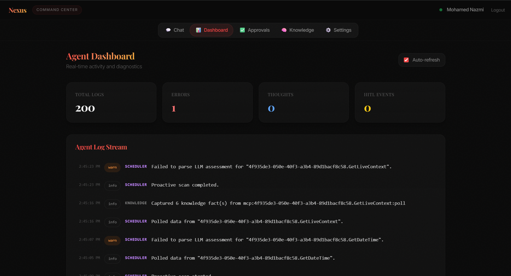
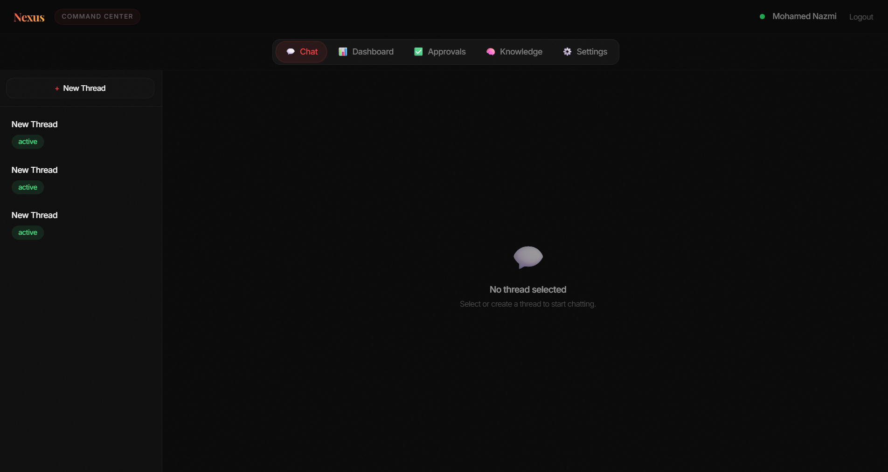
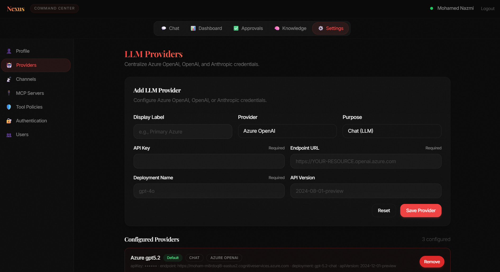
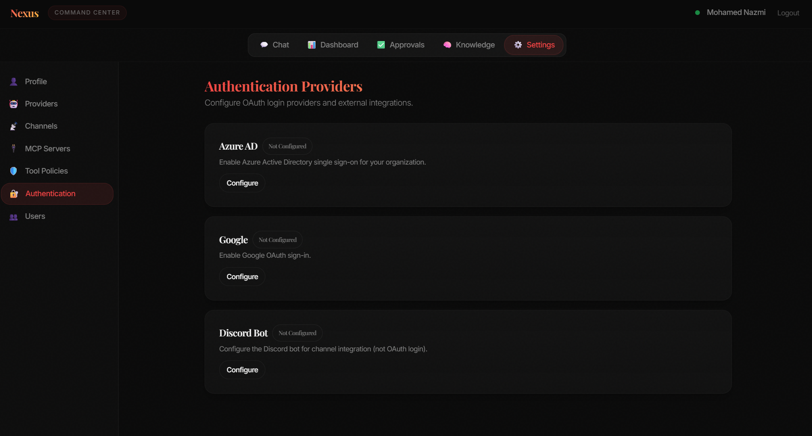
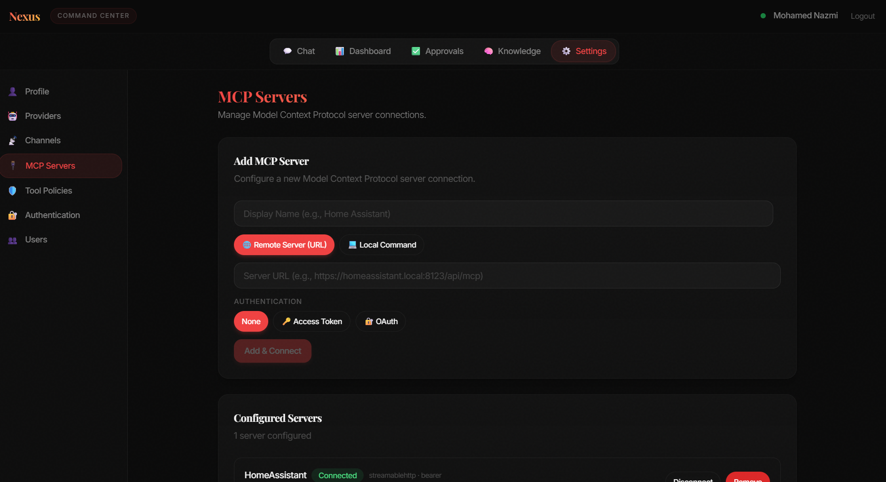
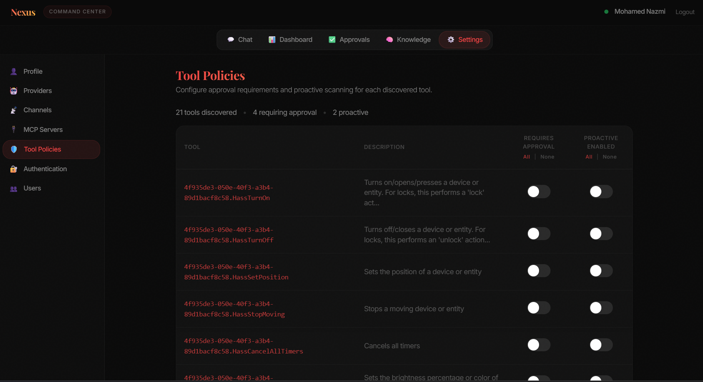
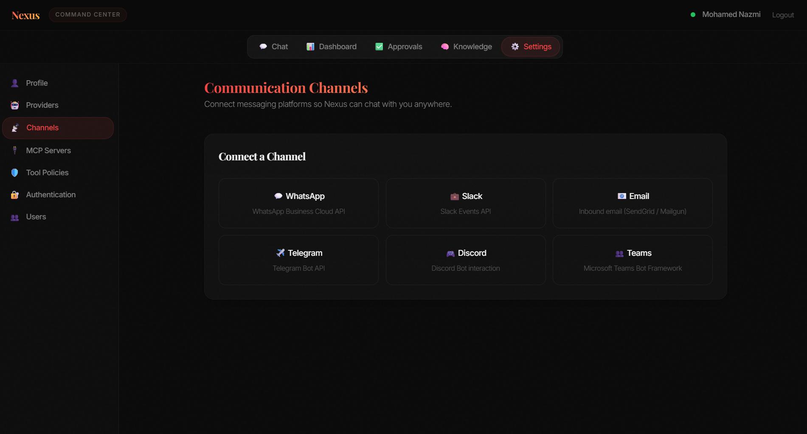
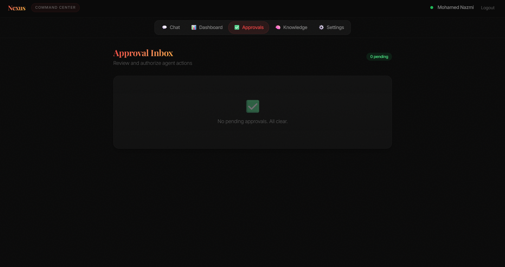
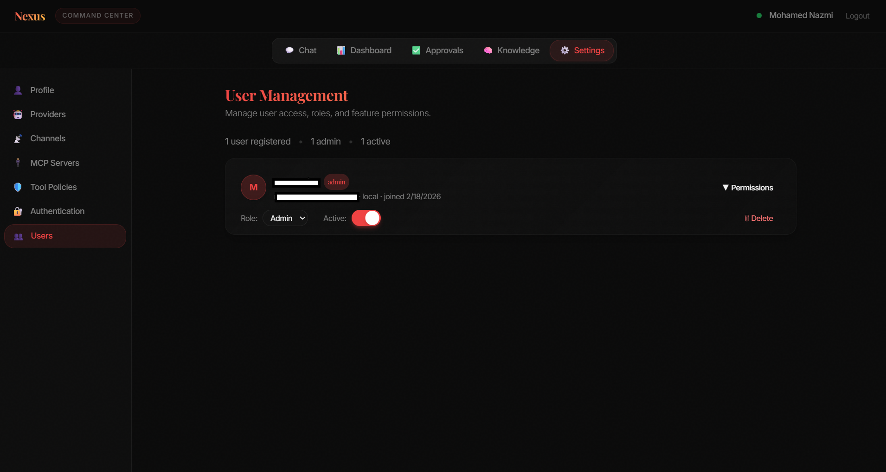
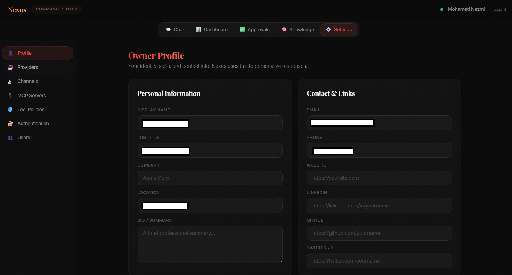

# Nexus Agent — Usage & Configuration

> Back to [README](../README.md) | [Architecture](ARCHITECTURE.md) | [Tech Specs](TECH_SPECS.md) | [Installation](INSTALLATION.md)

---

## User Interface (Command Center)

The Command Center is a single-page dashboard built with Material UI (MUI v7) featuring 7 switchable dark themes and Google Material Design components. All tabs are accessible from the top navigation bar.

| Tab | Description |
|-----|-------------|
| **Dashboard** | Real-time agent activity logs with level-based filtering |
| **Chat** | Threaded conversations with file attachments, inline screenshots, streaming responses, inline approval buttons, and live screen sharing |
| **Approvals** | Pending tool execution requests with approve/reject controls (user-scoped) |
| **Knowledge** | Searchable CRUD interface for the user's knowledge vault |
| **MCP Servers** | Add/remove/connect MCP servers with transport auto-detection and scope control |
| **Channels** | Configure communication channels (WhatsApp, Discord, Email, webhooks) |
| **LLM Config** | Add/switch between chat and embedding providers at runtime |
| **Profile** | Per-user profile editor (name, bio, skills, social links) with feature toggles |
| **Alexa** | Alexa Smart Home integration — configure credentials and control 14 smart home tools |
| **User Management** | *(Admin only)* Enable/disable users, change roles, manage per-user permissions |

---

## Chat

### Starting a Conversation

1. Open the **Chat** tab
2. Click **New Thread** to create a conversation
3. Type a message and press Enter or click Send

The agent responds with streaming text. If the agent needs to use a tool, the tool call is shown only when approval is required — otherwise tool interactions are hidden for a clean UX.

### File Attachments

Drag-and-drop or click the attachment button to upload files. Uploaded files are stored on the server and available to the agent for the duration of the thread.

### Screen Sharing

Click the screen share button to share your screen with the agent using the browser's `getDisplayMedia()` API. Captured frames are sent to the LLM as vision input — the agent can see what you see and reason about it.

> Screen sharing can be enabled/disabled per user in the **Profile** tab.

### Inline Approvals

When a tool call requires approval, an approve/deny button pair appears directly in the chat. No need to switch to the Approvals tab.

---

## LLM Configuration

LLM providers are configured entirely through the admin UI — no environment variables required.

### Adding a Provider

1. Open **Settings → LLM Providers**
2. Click **Add Provider**
3. Select a provider type:
   - **Azure OpenAI** — requires API key + endpoint URL + deployment name
   - **OpenAI** — requires API key + model name (e.g., `gpt-4o`)
   - **Anthropic** — requires API key + model name (e.g., `claude-sonnet-4-20250514`)
4. Set the purpose: **chat** (for conversations) or **embeddings** (for knowledge search)
5. Mark one chat provider and one embedding provider as **default**

### Switching Providers

Toggle the default provider at any time from the LLM Providers panel. Changes take effect immediately — no restart required.

### Embedding Models

If an embedding provider is configured, knowledge entries are stored with vector embeddings for semantic search. Without one, the system falls back to SQLite keyword (`LIKE`) search.

---

## Authentication Providers

OAuth login providers and Discord bot credentials are managed through the admin UI — no environment variables required.

### Configuring a Provider

1. Open **Settings → Authentication** (admin only)
2. Click **Configure** on the provider card you want to enable:

| Provider | Required Fields |
|----------|----------------|
| **Azure AD** | Client ID, Client Secret, Tenant ID |
| **Google** | Client ID, Client Secret |
| **Discord** | Bot Token, Application ID |

3. Fill in the credentials and click **Save**
4. The provider is immediately available on the sign-in page

### Enable / Disable

Use the toggle on each provider card to enable or disable it without removing the stored credentials.

### Sign-In Flow

- If **no OAuth providers** are configured, users sign in with email + password only
- Configured providers appear as buttons on the sign-in page alongside the credential form
- The first user to sign in automatically becomes the **admin**

---

## MCP Servers

### Adding an MCP Server

1. Open the **MCP Servers** tab
2. Click **Add Server**
3. Choose a transport type:

| Transport | Fields | Example |
|-----------|--------|---------|
| **Stdio** | Command, arguments, env vars | `npx @modelcontextprotocol/server-github` |
| **SSE** | Server URL | `http://homeassistant:8123/mcp/sse` |
| **Streamable HTTP** | Server URL | `http://homeassistant:8123/mcp` |

4. Set the **scope**:
   - **Global** — available to all users (admin only)
   - **User** — available only to you
5. Configure authentication if needed: None, Bearer Token, or OAuth

### Connecting

After adding, click **Connect** to establish the connection. Available tools are automatically discovered and shown in the tools list.

### Tool Policies

Each discovered tool gets a policy entry controlling:
- **Requires Approval** — whether the tool call needs HITL approval before execution
- **Proactive Enabled** — whether the scheduler can invoke this tool autonomously

Configure policies from the **Tool Policies** settings page or via the API.

---

## Model Orchestrator

The model orchestrator automatically selects the best LLM provider for each task based on the message content.

### Task Classification

Each incoming message is classified into one of four categories:

| Task Type | Signals | Preferred Provider |
|-----------|---------|--------------------|
| **Complex** | Debug, refactor, implement, code fences, multi-step reasoning | Primary tier (most capable model) |
| **Simple** | Short questions, definitions, calculations (<60 chars) | Secondary tier (fast, low-cost) |
| **Background** | Summarize, digest, TLDR, title generation | Local tier (free, on-device) |
| **Vision** | Screenshot, image, photo analysis, or attached images | Provider with vision capability |

### Routing Tiers

Each LLM provider can be assigned a routing tier from the **LLM Config** settings:

| Tier | Use Case | Example |
|------|----------|--------|
| **Primary** | Complex reasoning, code generation | GPT-4o, Claude Sonnet |
| **Secondary** | Quick answers, simple tasks | GPT-4o-mini, Claude Haiku |
| **Local** | Background tasks, summaries, title gen | LiteLLM proxy to local models |

If no tier is explicitly set, the orchestrator infers it from the model name (e.g., models containing "mini" are treated as secondary).

### Provider Scoring

The orchestrator scores each provider based on:
- **Tier match** — primary providers score highest for complex tasks
- **Capability match** — vision tasks require vision-capable models
- **Speed & cost** — simple/background tasks prefer fast, cheap providers
- **Availability** — only enabled providers with the "chat" purpose are considered

---

## Self-Extending Tools (Custom Tools)

Nexus can **create its own tools** at runtime. When the agent encounters a task that would benefit from a reusable tool, it can define, compile, and register a new tool — then immediately use it.

### How It Works

1. The agent calls `nexus_create_tool` with a name, description, input schema, and JavaScript implementation
2. The tool is syntax-checked, validated, and stored in the database
3. The tool becomes immediately available for use in the current and future conversations
4. Custom tools run in a **VM sandbox** with no access to the file system or process — only safe globals like `JSON`, `Math`, `Date`, `fetch`, `URL`, `Buffer`, and `console`

### Built-in Toolmaker Tools

| Tool | Description | Approval |
|------|-------------|----------|
| `nexus_create_tool` | Create a new custom tool | Always required |
| `nexus_list_custom_tools` | List all custom tools | Not required |
| `nexus_delete_custom_tool` | Delete a custom tool | Always required |

### Admin Management

From the **Custom Tools** settings page (admin only), you can:
- View all agent-created tools with their parameters and implementation code
- Enable or disable individual tools
- Delete tools that are no longer needed

### Safety

- Tool creation and deletion always require HITL approval
- Custom tool execution respects tool policies (configurable per tool)
- Sandboxed execution prevents access to `fs`, `process`, `require`, `child_process`
- 30-second execution timeout prevents runaway code

---

## Communication Channels

### Supported Channel Types

| Type | Configuration | How It Works |
|------|--------------|--------------|
| **WhatsApp** | Webhook URL + secret | Receives messages via WhatsApp Business API webhook |
| **Discord** | Bot token + application ID (admin UI or channel config) | Gateway bot responds to mentions, DMs, and `/ask` slash commands |
| **Email** | SMTP + IMAP credentials | Two-way shared inbox: IMAP receives inbound mail, SMTP sends replies/notifications |
| **Custom Webhook** | Auto-generated webhook URL + optional secret | Any service can POST messages to the channel endpoint |

### Setting Up a Channel

1. Open the **Channels** tab
2. Click **Add Channel**
3. Select the channel type and fill in the configuration
4. Copy the generated webhook URL and configure it in the external service

### Email Channel (Two-Way)

When connecting an **Email** channel, Nexus validates SMTP by sending a self-test email from the configured sender address to itself. Channel creation fails if this test fails.

Required fields:
- `smtpHost`, `smtpPort`, `smtpUser`, `smtpPass`, `fromAddress`
- `imapHost`, `imapPort`, `imapUser`, `imapPass`

Behavior:
- Inbound email is polled via IMAP and processed into threads.
- Outbound replies are sent via SMTP.
- Messages from unregistered senders are treated as notify-only (no action execution).
- Inbound email content is treated as untrusted input and wrapped with explicit injection guards before being passed to the agent.

### Notification Thresholds (Per User)

In the **Profile** tab, each user can choose a notification threshold:

- `Disaster only`
- `High + disaster`
- `Medium + high + disaster`
- `All notifications`

Every notify-able event (proactive approvals/failures, inbound unknown-email summaries, channel delivery failures) is assigned a severity level. The system sends channel notifications only when the event severity matches the selected threshold.

Channels are **user-scoped** — messages arriving on your channel are routed to your threads and knowledge vault.

### Discord Bot Setup

1. Open **Settings → Authentication → Discord** and enter your Bot Token and Application ID, or provide them in the Discord channel configuration
2. Invite the bot to your Discord server with message read/send permissions
3. The bot responds to:
   - **Mentions** (`@NexusAgent what's the weather?`)
   - **DMs** (direct messages to the bot)
   - **Slash commands** (`/ask <question>`)

---

## Knowledge Vault

### Automatic Knowledge Capture

After every agent response, the LLM extracts durable facts from the conversation and stores them in your personal knowledge vault. No manual input needed.

Captured knowledge follows an **entity-attribute-value** model:
- **Entity** — the subject (e.g., "Mohamed", "Project X")
- **Attribute** — what's being stored (e.g., "email", "deadline")
- **Value** — the actual data

### Manual Management

From the **Knowledge** tab you can:
- **Search** — find entries by keyword or semantic similarity
- **Add** — manually create knowledge entries
- **Edit** — update existing entries
- **Delete** — remove outdated information

### Semantic Search

If an embedding model is configured, knowledge retrieval uses cosine similarity to find the most relevant entries. The top-K results are included in the agent's context before responding.

---

## Human-in-the-Loop (HITL)

### How It Works

1. The agent decides to call a tool
2. The gatekeeper checks the tool's policy
3. If `requires_approval` is true → execution is **paused** and an approval request is created
4. You review the request in the **Approvals** tab or via inline chat buttons
5. On **approve** — the tool executes and the agent loop resumes automatically
6. On **reject** — the agent is informed and adjusts its approach

### Default Policies

- **File write/delete operations** — approval required by default
- **MCP server tools** — approval required by default (configurable per tool)
- **Custom tool creation/deletion** — policy-driven (configured in tool policies)
- **Email sending (`builtin.email_send`)** — approval required by default
- **Alexa mutating tools** — announce, light/volume/DND changes require approval by default
- **Web search/fetch** — no approval required
- **Browser automation** — no approval required

### Approval Inbox

The Approvals tab shows all pending requests for your threads. Each entry displays:
- The tool name and arguments
- The agent's reasoning for wanting to call the tool
- Approve / Reject buttons

### Admin Notifications for Approvals

When a tool or proactive action requires approval, Nexus notifies **admin users only** via configured channels:
1. Prefer IM channels (currently WhatsApp/Discord when configured and mapped)
2. Fallback to Email channel

To receive IM notifications, map the admin user in the channel user mapping for that channel.

---

## Alexa Smart Home

Nexus includes a native integration with Amazon Alexa that exposes 14 smart home tools to the agent. No external MCP server or Docker container required — the tools run directly inside Nexus.

### Setup

1. Open **Settings → Alexa** (admin only)
2. Enter your `UBID_MAIN` and `AT_MAIN` cookies from an authenticated Alexa session at [alexa.amazon.com](https://alexa.amazon.com)
3. Click **Save Credentials** — values are encrypted at rest using AES-256-GCM

> **How to get cookies:** Sign in to [alexa.amazon.com](https://alexa.amazon.com) in your browser, open DevTools → Application → Cookies, and copy the values of `ubid-main` and `at-main`.

### Available Tools (14)

| Tool | Description | Approval Required |
|------|-------------|:-:|
| `alexa_announce` | Send text-to-speech announcement to one or all Echo devices | ✅ |
| `alexa_get_bedroom_state` | Get bedroom temperature, illuminance, motion, and light state | ❌ |
| `alexa_list_lights` | List all smart home light devices with IDs and capabilities | ❌ |
| `alexa_set_light_power` | Turn a smart light on or off | ✅ |
| `alexa_set_light_brightness` | Set light brightness (0–100) | ✅ |
| `alexa_set_light_color` | Set light color by name or Kelvin temperature (2200–6500) | ✅ |
| `alexa_get_music_status` | Get currently playing track, artist, provider, and progress | ❌ |
| `alexa_get_device_volumes` | Get volume levels of all Alexa devices | ❌ |
| `alexa_set_device_volume` | Set device volume to a specific level (0–100) | ✅ |
| `alexa_adjust_device_volume` | Adjust device volume by a relative amount (-100 to +100) | ✅ |
| `alexa_get_all_sensor_data` | Get temperature, illuminance, and motion from all sensors | ❌ |
| `alexa_list_smarthome_devices` | List all smart home devices with categories and endpoints | ❌ |
| `alexa_get_dnd_status` | Get Do Not Disturb status for all devices | ❌ |
| `alexa_set_dnd_status` | Enable or disable DND on a specific device | ✅ |

### Security

- Credentials are **encrypted at rest** using AES-256-GCM column encryption (same as LLM API keys)
- The GET endpoint returns **masked** credential values (first/last few characters only)
- All mutating tools (announce, light/volume/DND changes) require **HITL approval** by default
- Read-only tools (sensors, status, listing) execute without approval
- Device discovery results are cached in-memory for 5 minutes to reduce API calls
- Tool approval policies are configurable in **Settings → Tool Policies**

---

## Proactive Scheduler

### What It Does

A background cron job that monitors proactive-enabled MCP tools on a configurable interval:

1. Polls proactive-enabled tools for new data
2. Retrieves relevant user knowledge for context
3. Calls the LLM to assess whether any data needs attention
4. Executes actions automatically when policy allows; otherwise creates approval requests and sends admin notifications

### Enabling Proactive Tools

1. Connect an MCP server with tools you want to monitor
2. Go to the tool's policy settings
3. Toggle **Proactive Enabled** to on
4. The scheduler will start polling that tool on its configured interval

---

## User Management (Admin)

### Managing Users

From the **User Management** tab, admins can:

| Action | Description |
|--------|-------------|
| **View all users** | See email, role, status, and sign-up date |
| **Change role** | Promote user to admin or demote to user |
| **Enable/Disable** | Disabled users cannot sign in |
| **Manage permissions** | Toggle per-user access to: Knowledge, Chat, MCP, Channels, Approvals, Settings |
| **Delete user** | Permanently remove a user and their data |

### Permission Granularity

| Permission | Controls Access To |
|-----------|-------------------|
| `can_knowledge` | Knowledge vault (view, search, add, edit, delete) |
| `can_chat` | Chat threads and conversations |
| `can_mcp` | MCP server management |
| `can_channels` | Communication channel configuration |
| `can_approvals` | HITL approval inbox |
| `can_settings` | LLM config and profile settings |

---

## Profile Settings

Each user can customize their profile from the **Profile** tab:

- **Display name, title, bio** — shown in the UI
- **Contact info** — phone, email, website
- **Social links** — LinkedIn, GitHub, Twitter
- **Skills & languages** — stored as JSON arrays
- **Feature toggles** — enable/disable features like screen sharing
