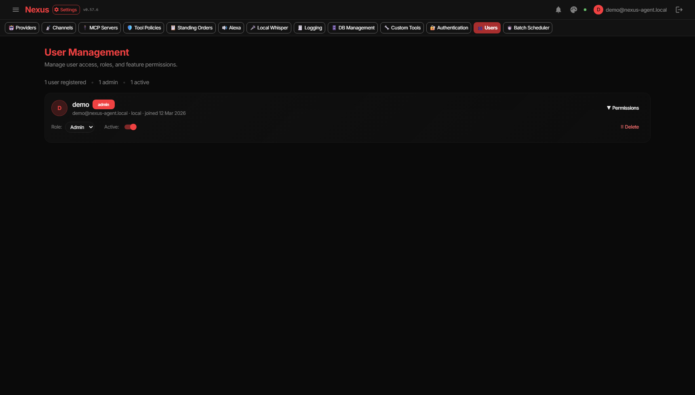
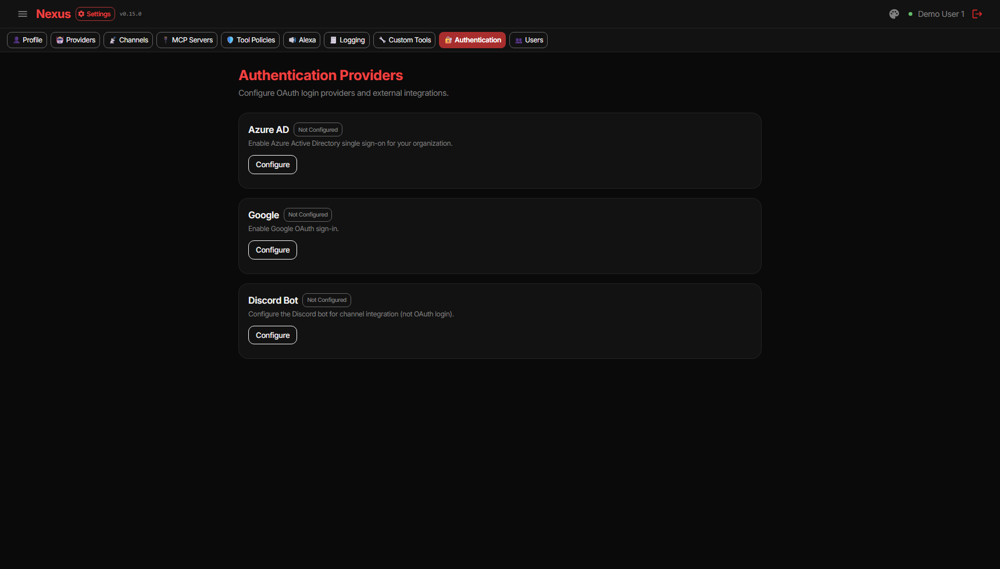
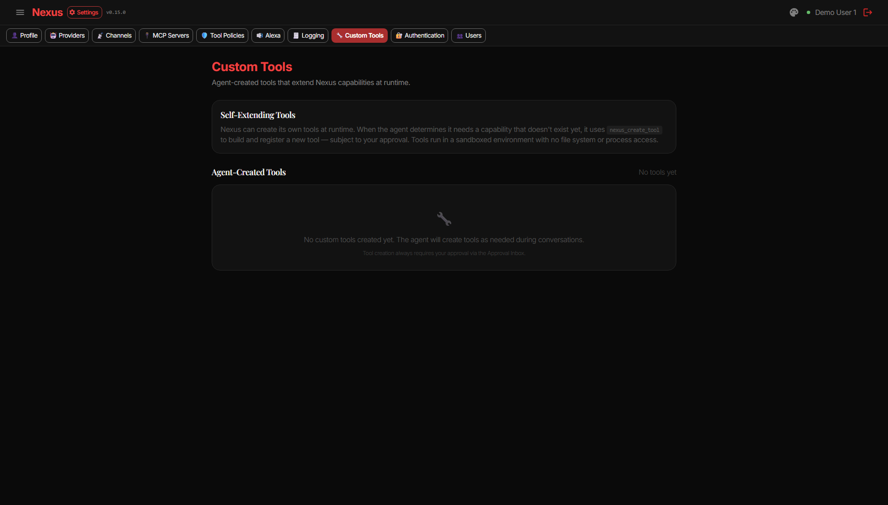

# Nexus Agent — Admin Operations

> Back to [Usage Overview](USAGE.md) | [Configuration](USAGE_CONFIGURATION.md)

---

> **Summary:** Admin-only responsibilities — user management, authentication providers, custom tool governance, scheduler operations, and DB management.

---

## User Management

Manage accounts, roles, and permissions from Settings → Users.

- Activate/deactivate accounts
- Promote/demote roles (admin ↔ user)
- Grant/revoke granular permissions (knowledge, chat, MCP, channels, approvals, settings)

---

## Authentication Providers

Configure OAuth sign-in providers from Settings → Authentication.

| Provider | Required Fields |
|----------|----------------|
| Azure AD | Client ID, Client Secret, Tenant ID |
| Google | Client ID, Client Secret |
| Discord | Bot Token, Application ID |

---

## Custom Tool Governance

Review and manage agent-created tools from Settings → Custom Tools.

Tools run in a VM sandbox with restricted runtime surface and timeout-bound execution. Use Tool Policies to control approval requirements.

---

## MCP Server Access Control

Settings → MCP Servers → edit any server to control who can use it:

- **Global** — the server is available to all users (default)
- **Restricted** — only users you assign can use it; tick each user in the checklist that appears when Restricted is selected

Use Restricted scope for high-privilege servers (e.g. HomeAssistant, file system, internal APIs) where you do not want every user to have access.

---

## Scheduler Console

Settings → Scheduler provides a live operations console:
- **Header Tasks** grid showing all schedules
- **Child Tasks** and recent runs when a header is selected
- **Focus View** for full run history with task-run log links
- Health metrics via the API (`GET /api/scheduler/health`)

**Default schedules (seeded on every fresh install):**

| Schedule | Default Status | Notes |
|----------|---------------|-------|
| System Proactive Scan | Active | Runs every 15 min |
| System DB Maintenance | Active | Runs hourly |
| System Knowledge Maintenance | Active | Runs every 60 s |
| Job Scout Pipeline | **Paused** | Activate after configuring job preferences |
| Email Monitoring | **Paused** | Activate after configuring an Email channel |

Resume paused schedules from the Scheduler console once the prerequisite configuration is in place.

---

## DB Management

Settings → DB Management (admin-only) for monitoring and cleanup:
- Table-level size breakdown and host resource snapshot
- Manual cleanup runs for logs, threads, attachments, orphan files
- Recurring retention policies

---

## Regular Review Checklist

- Tool approval defaults and scope settings
- Proactive scheduler configuration and health
- Channel routing and alert thresholds
- Credential status and encryption key consistency
