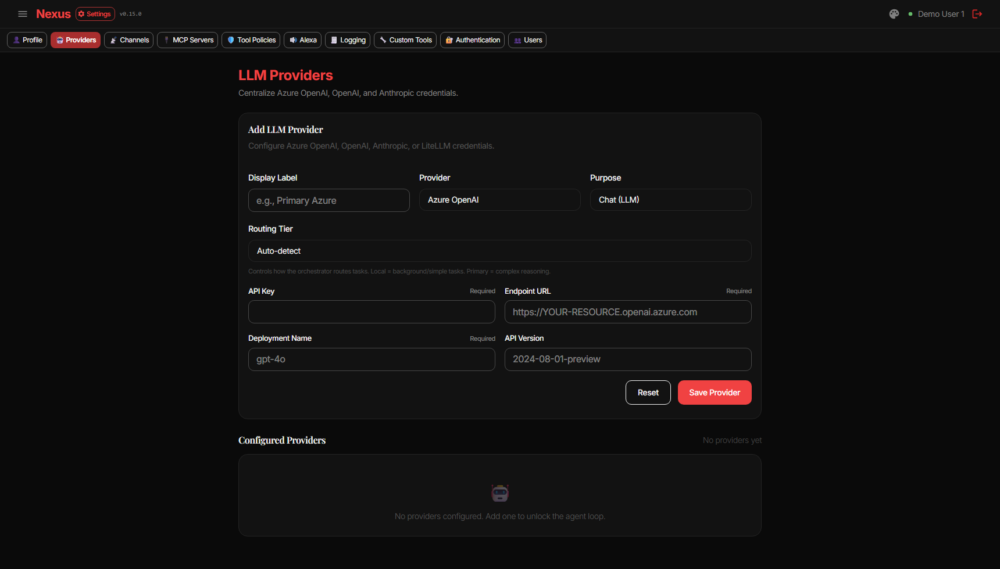
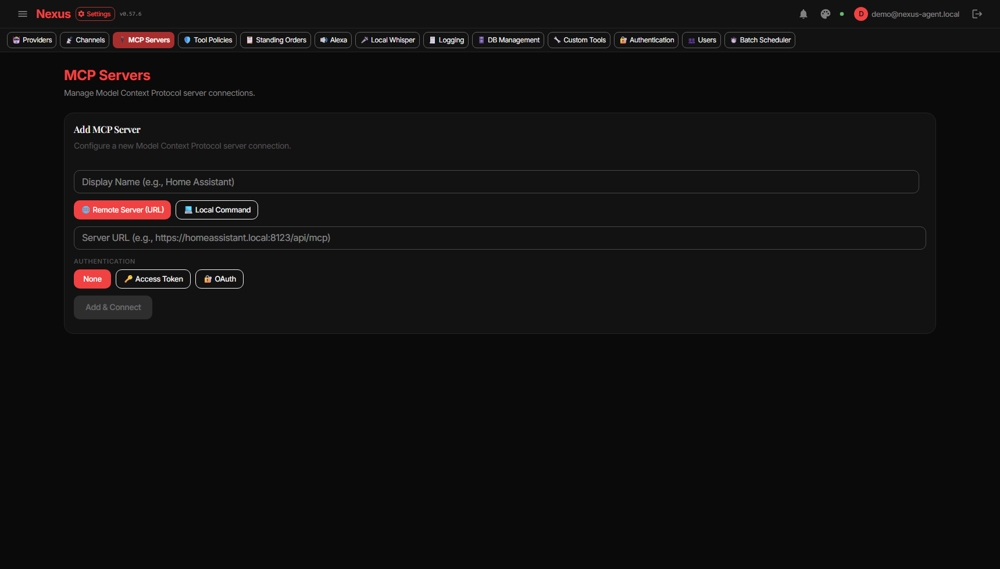
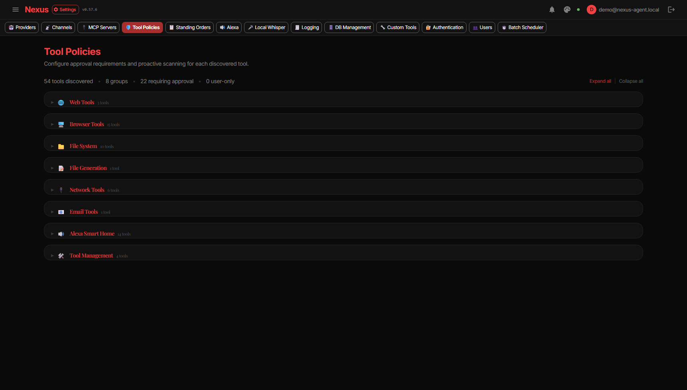
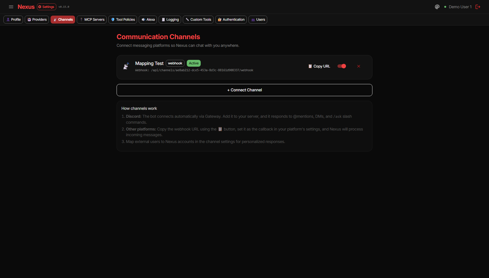
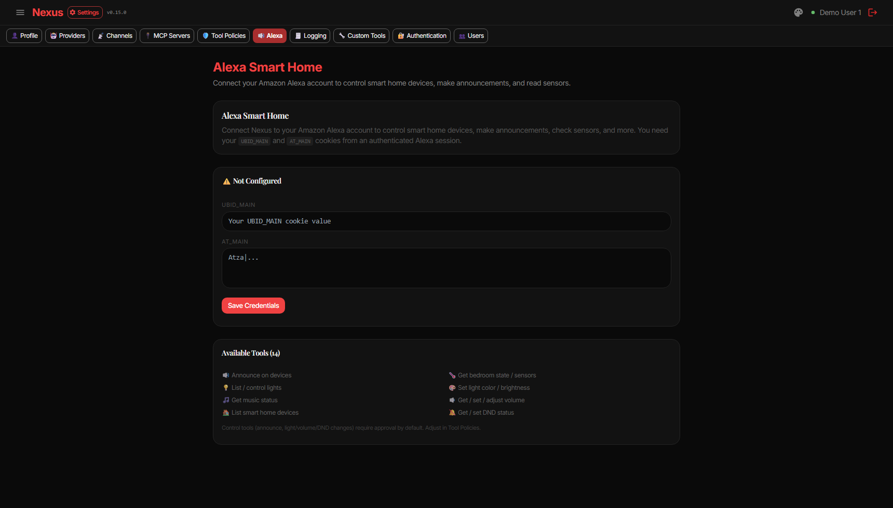

# Nexus Agent — Configuration Guide

> Back to [Usage Overview](USAGE.md) | [Admin Operations](USAGE_ADMIN.md)

---

> **Summary:** Runtime configuration for LLM providers, MCP servers, tool policies, channels, Alexa, Whisper, and voice mode — all managed through the Settings UI.

---

## LLM Providers

Configure chat, embedding, STT, and TTS providers. Nexus routes tasks via the orchestrator based on model capabilities and tier.

| Provider | Required Fields |
|----------|----------------|
| Azure OpenAI | API key, endpoint, deployment/model |
| OpenAI | API key, model |
| Anthropic | API key, model |

---

## MCP Servers

Add external tool servers, connect, and discover tools. Supports auto-refresh when servers add/remove tools at runtime.

| Transport | Example |
|-----------|---------|
| Stdio | Local command + args |
| SSE | `http://host:port/.../sse` |
| Streamable HTTP | `http://host:port/...` |

Scopes: **Global** (shared with all users) or **User** (owner-only).

---

## Tool Policies

Each discovered tool has two controls:

- **Requires Approval** — whether human approval is needed before execution
- **Scope** — **Global** (all users) or **User Only** (admin-only)

Discovery is architecture-driven and includes all currently registered BaseTool categories, MCP-discovered tools, and enabled custom tools.

---

## Channels

Configure inbound/outbound messaging integrations.

| Type | Purpose |
|------|---------|
| WhatsApp | Webhook messaging |
| Discord | Bot interaction (mentions, DM, slash commands) |
| Email | Two-way SMTP + IMAP |
| Phone Call | Voice webhook flow using conversation capability |
| Webhook | Generic inbound API endpoint |

---

## Alexa Smart Home

Native integration with 14 built-in tools for announcements, lights, volume, sensors, and DND.

Setup: Settings → Alexa → enter `UBID_MAIN` and `AT_MAIN` cookies → Save.

---

## Local Whisper

Optional local STT fallback when cloud Whisper is unavailable.

1. Settings → Local Whisper → Enable
2. Enter server URL (e.g. `http://localhost:8083`)
3. Set model name → Test Connection → Save

Compatible servers: **faster-whisper-server** (Python/CUDA) or **whisper.cpp** (C++).

---

## Voice Conversation

The **Conversation** tab provides hands-free voice mode:

1. Click the microphone to start
2. VAD detects end-of-speech automatically
3. Response is spoken back, then auto-listen resumes
4. Use Auto/Manual toggle, voice selector, or Stop button as needed

Requires HTTPS or localhost, plus configured STT, TTS, and LLM providers.

---

## Knowledge Storage Optimization (SQLite)

Embeddings remain in SQLite (no external vector service required) using binary + compression storage.

Environment settings:

- `EMBEDDING_COMPRESSION` — `none` | `gzip` | `zstd` (default `gzip`)
- `EMBEDDING_LAZY_INDEX` — `1` to generate missing embeddings on-demand during active retrieval
- `EMBEDDING_LAZY_INDEX_MAX_PER_QUERY` — max missing records to hydrate per query
- `KNOWLEDGE_ARCHIVE_DAYS` — archive threshold in days (default `180`)
- `KNOWLEDGE_ARCHIVE_DB_PATH` — path to archive SQLite DB for old knowledge/embeddings

Behavior:

- Active knowledge stays in primary DB for fast transactional access
- Older knowledge is archived into a separate SQLite archive DB by maintenance worker
- Legacy JSON embeddings are migrated to binary/compressed form on startup
