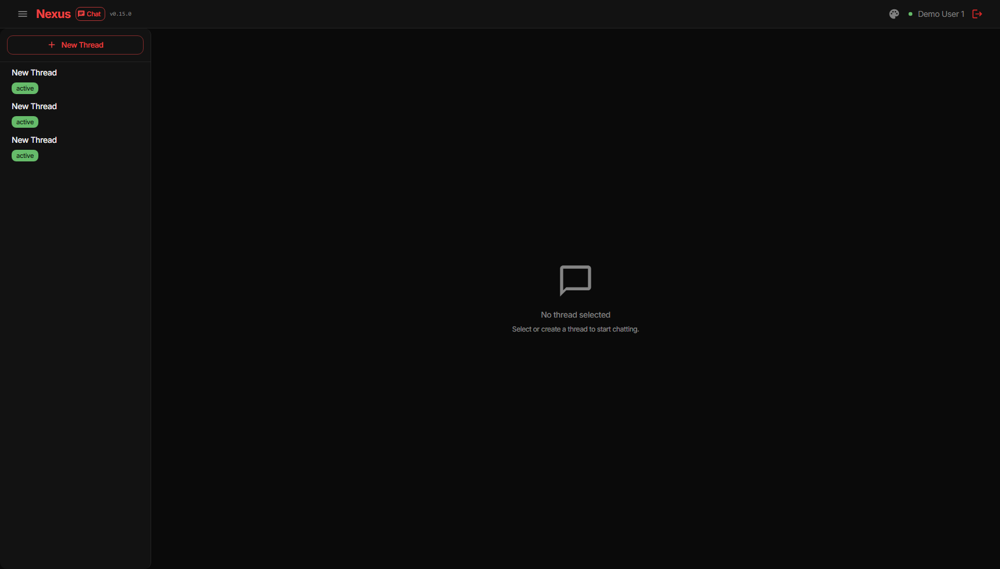
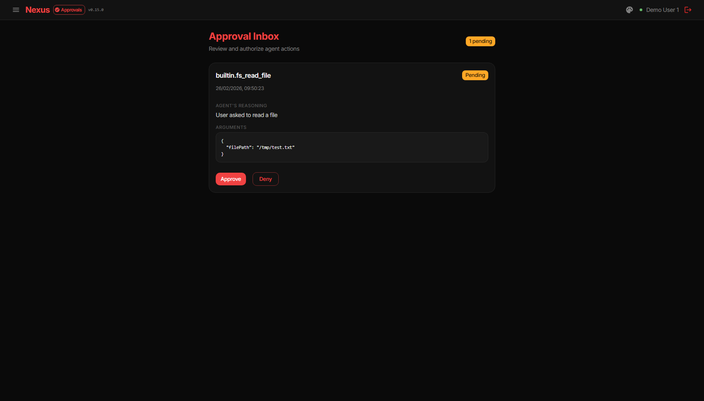
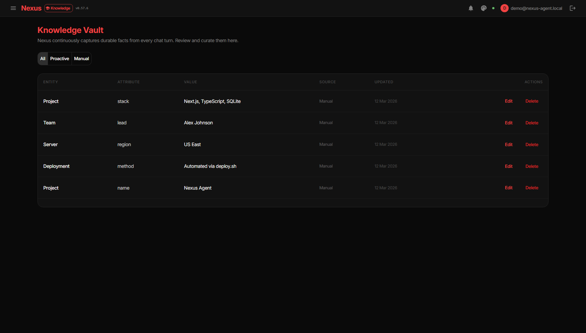
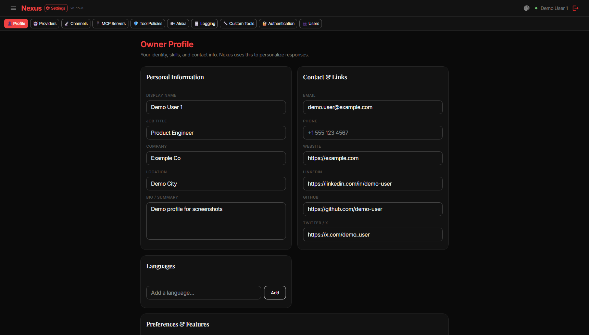

# Nexus Agent — Daily Workflows (End Users)

> Back to [Usage Overview](USAGE.md) | [Getting Started](USAGE_GETTING_STARTED.md) | [Troubleshooting](USAGE_TROUBLESHOOTING.md)

---

## Chat Workflow

Use Chat for day-to-day assistant interactions.

- Start/select a thread
- Send prompts and receive streaming responses — intermediate thinking steps (tool calls, results) appear in real-time as the agent works
- Every response shows an "Analyzing…" block that reveals the agent's internal process: model selection, knowledge retrieval, and LLM generation — even for simple questions with no tool calls
- Each message shows a timestamp
- Expand the "Thought for N steps" block to see the agent's reasoning process, tool calls, and results
- Add file attachments when needed
- Use screen sharing when enabled in your profile
- **Voice input** — Click the mic button (🎤) to dictate a message. Audio is transcribed via Whisper and appended to the input field. The button pulses red while recording and shows a spinner while transcribing.
- **Voice output** — Click the speaker icon (🔊) on any assistant message to hear it read aloud via TTS. Click again to stop. Choose your preferred voice (alloy, ash, coral, echo, fable, onyx, nova, sage, shimmer) in **Settings → Profile → Preferences → TTS Voice**. Requires an OpenAI-compatible LLM provider to be configured.

## Approval Workflow

When a tool action requires approval:

1. Assistant pauses execution
2. Request appears inline and in Approvals
3. You approve or reject
4. Assistant continues based on decision

**Proactive approvals** — The background scheduler can also create approval requests for actions it detects (e.g. a smart home device anomaly). These appear in the Approvals tab with a "Proactive" badge and are visible to admins. When approved, the tool is executed directly without needing a chat thread.

## Knowledge Workflow

The knowledge vault stores user-scoped memory.

- Search existing facts
- Add/edit/delete entries
- Use it to keep long-running context accurate

## Profile Workflow

From **Account menu (top-right) → Profile** or **Settings → Profile**:

- Update personal metadata
- Set notification threshold (`low`, `medium`, `high`, `disaster`)
- Control personal experience options available in your deployment

